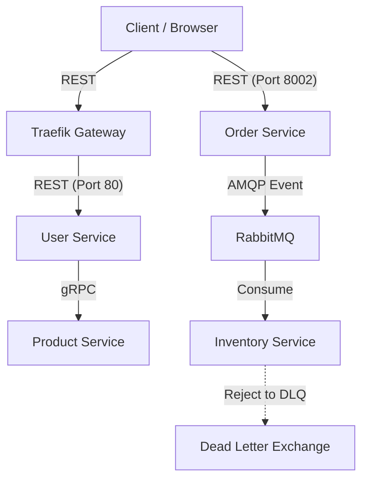

# FastAPI Microservices (Fast Store)

Welcome to **Fast Store**, a comprehensive, educational microservices ecosystem built from the ground up!

This repository serves as the complete codebase for the hands-on tutorial series on building microservices so far. You can use this repository to follow along with the series or to explore the foundational architecture independently.

**Tech Stack Highlights:** **FastAPI**, **SQLModel**, **gRPC**, **RabbitMQ**, **PostgreSQL**, and a full observability stack (Promtail, Loki, Jaeger, Grafana).

📺 **YouTube Playlist:** [Building Microservices with FastAPI](https://www.youtube.com/playlist?list=PLdtwawCR2QjlCvbu2WJ-8EiJNHmJuprvT)

---

## 🏗️ Architecture Overview

The project demonstrates a polyglot communication strategy (REST, gRPC, and Asynchronous Messaging) across four distinct services:

### 🛠️ Services

- **User Service (`/users`)**: 
  - Manages user profiles and authentication (JWT).
  - Orchestrates data from other services via **gRPC**.
  - Built with **SQLModel** & **PostgreSQL**.
- **Product Service**: 
  - A high-performance internal service providing product data.
  - Communicates exclusively via **gRPC** for efficient inter-service data transfer.
- **Order Service (`/orders`)**: 
  - Handles order placement.
  - Uses an **Event-Driven** approach, publishing "OrderPlaced" events to RabbitMQ for asynchronous processing.
- **Inventory Service**: 
  - Consumes order events and manages stock levels.
  - Implements **Dead Letter Exchange (DLX)** patterns for robust error handling and message reliability.
- **Logging & Monitoring**:
  - **Promtail**: Scrapes logs from container stdout/stderr via the Docker socket.
  - **Loki**: Optimized log aggregation system.
  - **Grafana**: The visualization layer for both logs (Loki) and traces (Jaeger).

### 🔄 Communication Flow



---

## 🧰 Tech Stack & Observability

- **Core**: Python 3.12, FastAPI, SQLModel, UV (Workspace management)
- **Infrastructure**: 
  - **PostgreSQL**: Primary relational database.
  - **RabbitMQ**: Message broker with Direct Exchange and DLX.
  - **Traefik**: Edge router and API Gateway.
- **Observability**:
  - **Jaeger (OpenTelemetry)**: Distributed tracing across services.
  - **Loki & Promtail**: Centralized log aggregation.
  - **Grafana**: Unified dashboard for logs and metrics.
- **Orchestration**: Docker Compose & Kubernetes.

---

## 📂 Project Structure

```text
fast-store/
├── compose.yaml                 # Docker Compose (Full stack)
├── k8s/                         # Kubernetes manifests
├── services/
│   ├── user-service/            # Auth, User Ops, gRPC Client
│   ├── product-service/         # gRPC Server
│   ├── order-service/           # Event Publisher
│   └── inventory-service/       # Event Consumer
├── shared/                      # Common JWT utils & Middlewares
└── protos/                      # gRPC Protocol Buffers
```

---

## 🚀 Getting Started

### Prerequisites

- [uv](https://docs.astral.sh/uv/) (Modern Python package manager)
- [Docker & Docker Compose](https://www.docker.com/)

### Run with Docker

```bash
docker compose up --build
```

- **API Gateways**: 
  - `user-service`: Accessible via Traefik at `http://localhost`
- **Direct Service Access**:
  - `order-service`: `http://localhost:8002`
  - `inventory-service`: `http://localhost:8003`
- **Docs**: `http://localhost/docs` (User Service)
- **Dashboard (Grafana)**: `http://localhost:3000` (User: `admin`, Pass: `admin`)
- **Tracing (Jaeger)**: `http://localhost:16686`
- **RabbitMQ Management**: `http://localhost:15672` (guest/guest)

---

## ✅ Tutorial Progress

| Day | Topic | Status |
|-----|-------|--------|
| Day 1 | Microservices Architecture Overview | ✅ |
| Day 2 | Professional Microservices Workspace | ✅ |
| Day 3 | SQLModel & CRUD Endpoints | ✅ |
| Day 4 | Docker, Compose & PostgreSQL | ✅ |
| Day 7 | API Gateway & Shared Authentication | ✅ |
| Day 8 | Message Broker Integration | ✅ |
| Day 9 | Event-Driven Workflow | ✅ |
| Day 10| Dead Letter Queues | ✅ |
| Day 12| Centralized Logging (Loki, Promtail, Grafana) | ✅ |
| Day 13| Kubernetes, Health Checks & Self-healing | ✅ |
| Day 15| CI/CD Pipelines | ✅ |
| Day 16| Scaling and Load Balancing | ✅ |

---

## 📜 License

This project is for educational purposes. Feel free to use it as a reference for your own architectural designs.
